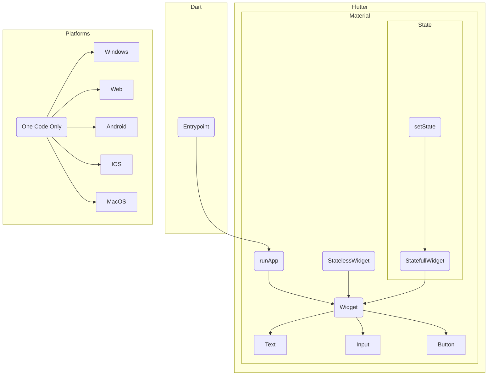

```mermaid
graph TD
subgraph Dart
    A(Entrypoint)
end
A-->rA
subgraph Flutter
    subgraph Material
        rA(runApp)
        rA-->w(Widget)
        w-->Text
        w-->Input
        w-->Button
        sW(StatelessWidget)-->w
        sfW(StatefullWidget)-->w
    subgraph State
    ss(setState)-->sfW
    end
    end
end
subgraph Platforms
oco(One Code Only)
oco-->Windows
oco-->Web
oco-->Android
oco-->IOS
oco-->MacOS
end

```